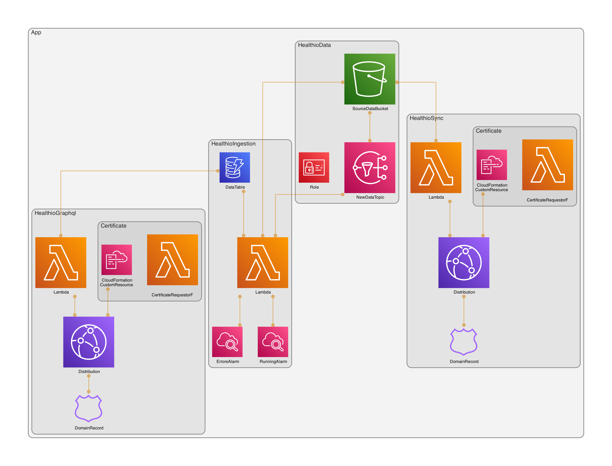

# Healthio

- Uses [Health Auto Export](https://apps.apple.com/us/app/health-auto-export-json-csv/id1115567069) to send data from iPhone into the system
- Sync Lambda recieves the data and writes it to S3
- Ingestion Lambda parses data in S3 and writes data into DynamoDB
- GraphQL Lambda provides a GraphQL interface onto the DynamoDB table

